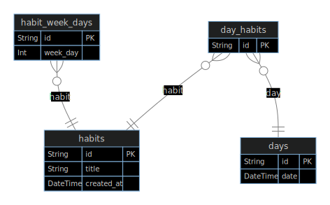

<h1 align="center"> NLW SETUP </h1>

<p align="center">
Evento exclusivo e gratuito, promovido pela Rocketseat para ensino de tecnologias WEB.
</p>

<p align="center">
  <a href="#-tecnologias">Tecnologias</a>&nbsp;&nbsp;&nbsp;|&nbsp;&nbsp;&nbsp;
  <a href="#-projeto">Projeto</a>&nbsp;&nbsp;&nbsp;|&nbsp;&nbsp;&nbsp;
  <a href="#-layout">Layout</a>&nbsp;&nbsp;&nbsp;|&nbsp;&nbsp;&nbsp;
  <a href="#card_file_box-databaseerd">Database(ERD)</a>&nbsp;&nbsp;&nbsp;|&nbsp;&nbsp;&nbsp;
  <a href="#checkered_flag-iniciar-aplicação">Iniciar aplicação</a>&nbsp;&nbsp;&nbsp;|&nbsp;&nbsp;&nbsp;
  <a href="#memo-licença">Licença</a>
</p>

<p align="center">
  
</p>

<br>

<p align="center">
  
</p>

## 🚀 Tecnologias

Esse projeto foi desenvolvido com as seguintes tecnologias:
* Backend
  - [TypeScript](https://www.typescriptlang.org/)
  - [Node e NPM](https://nodejs.org/)
  - [Fastify](https://www.fastify.io/)
  - [Prisma ORM](https://www.prisma.io/) com SQLite
  - Dayjs para manipular datas
  - Zod para validação dos dados

* Frontend Web
  - [Vite](https://vitejs.dev/)
  - [React](https://reactjs.org/)
  - [TailwindCSS](https://tailwindcss.com/) para estilização
  - [Phophor-React](https://github.com/duongdev/phosphor-react-native) para ícones
  - [Radix-UI](https://www.radix-ui.com/) para acessibilidade

* Frontend Mobile
  - [Expo](https://expo.dev/)
  - [React Native](https://reactnative.dev/)
  - [React-Navigation](https://reactnavigation.org/)
  - [NativeWind](https://www.nativewind.dev/) para estilização
  - [React-Native-Reanimated](https://docs.swmansion.com/react-native-reanimated/)

## 💻 Projeto

O Habits é um app para monitoramento de tarefas diárias, o app permite criar novas tarefas/hábitos de acordo os dias da semana que o usuário desejas realizar-las. Também permite o usuário marcar tarefas realizadas indicar de formar visual o status das tarefas realizadas no dia atual e dias anteriores pela tela principal.

## 🔖 Layout

Você pode visualizar o layout do projeto através [DESSE LINK](https://www.figma.com/file/mZhpRePUEXuSJIB3xbzVl7/Habits-(i)-(Community)?node-id=6%3A343&t=vjUP7h6ZmEM1ak7z-1). É necessário ter conta no [Figma](https://figma.com) para acessá-lo.

## :card_file_box: Database(ERD)

<p align="center">
  
</p>

## :checkered_flag: Iniciar aplicação

```bash

git clone https://github.com/JairGino/nlw-Setup.git
```
### ⚙ Backend

```bash

cd/nlw-Setup/server
npm install
npm run dev
```

### 🖥️ Frontend Web

```bash

cd/nlw-Setup/web
npm install
npm run dev
```

### 📱 Frontend Mobile

```bash

cd/nlw-Setup/web
npm install
npx expo start --clear
```

## :memo: Licença

Esse projeto está sob a licença MIT.

---

<a href="#top">Voltar ao topo</a>